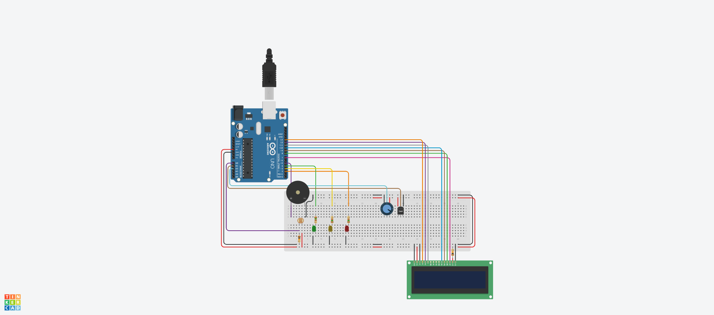

## Vinheria Agnello
A Vinheria Agnello é uma vinheria brasileira que começou suas operações em São Paulo há mais de 15 anos. Com apenas uma loja física, a empresa é reconhecida por sua ampla variedade de rótulos de vinícolas nacionais e internacionais. Um dos principais diferenciais da Vinheria Agnello é o treinamento de seus vendedores, que orientam os clientes sobre as características de cada variedade de uva, região, vinícola ou rótulo de vinho. Eles também sugerem combinações com diversos tipos de alimentos e refeições, adaptando os vinhos às diferentes ocasiões de consumo.

## Projeto 
Desenvolver um sistema embarcado que soa um alarme e informa por meio de LED's e um monitor LCD se a luminosidade, umidade e temperatura do ambiente estão adequeadas para o armazenamento de vinhos.

# Tecnologias
- Arduíno
- C++

# Motivação
Se trata do checkpoint/avaliação para a matéria de Edge Computing and Computer Systems, ministrada pelo professor Lucas Augusto.

# Membros
- Marcos Ferreira (RM 556228)
- Alex Ribeiro (RM 557356)
- Davi Vieira (RM 556798)
- Luca Monteiro (RM 556906)
- Felipe Vicente (RM 555819)

# Protótipo
O projeto também pode ser acessado [clicando aqui](https://www.tinkercad.com/things/0iTzjwcOyiw-marcos-checkpoint-2-edge-computing-and-computer-systems)

